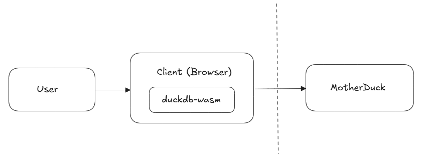

# Simulating MotherDuck's 1.5-Tier Architecture in the Browser



I want to experiment with MotherDuck's 1.5-tier architecture by simulating a setup where **DuckDB-Wasm runs in the browser**, caching data fetched from a **MotherDuck remote server**.

## 💡 Architecture Overview

-   **Step 1:** Fetch data from MotherDuck and store it in DuckDB-Wasm.
-   **Step 2:** Allow users to run SQL queries against the cached dataset in the browser.
-   **Step 3:** Display query results instantly.

## 🚀 What I Learned

### 1️⃣ WASM is not scary!

WASM felt mystical but working with DuckDB-Wasm demystified it:

-   WASM is a compilation target for languages like C or Rust. Since DuckDB was written in C, compiling it to WASM instead maintaining a separate TypeScript version avoids duplicate code and results in better performance.

-   Loading WASM is simple: DuckDB-Wasm exposes a clean API that lets me set up a fully functional database in just a few lines of code.

-   One caveat: `webpack` doesn't automatically bundle wasm files. My `next.config.mjs` file demonstrates how to configure `webpack` to do so in a Next.js application.

### 2️⃣ DuckDB-Wasm can cache and query remote data from MotherDuck

By fetching data from MotherDuck and storing it in DuckDB-Wasm’s in-memory storage, I was able to create a local cache for running queries in the browser.

This approach reduces latency for repeated queries and enables offline query execution once data is cached. It becomes much clearer how projects like [Mosaic](https://github.com/uwdata/mosaic) can load so much data so quickly.

### 3️⃣ The `motherduck` extension is not available in DuckDB-Wasm

I initially planned to execute a dual query in browser, referencing both a local DuckDB-Wasm database and a remote MotherDuck database in the same SQL statement. However, I was surprised when I encountered the error...

```
Extension https://extensions.duckdb.org/v1.1.1/wasm_eh/motherduck.duckdb_extension.wasm is not available
```

... when I tried to `LOAD motherduck`. Turns out `motherduck` extension is not available in DuckDB-Wasm.

> **Question for the team:** Is the lack of `motherduck` extension in Wasm intentional, or are there plans to support it in the future?

## 🛠️ Getting Started

Clone this repository and run the development server:

```bash
npm install
npm run dev
```

Open http://localhost:3000 in your browser to start querying!

## 👋🏼 That's It!

This project was a fascinating deep dive into the current capabilities of DuckDB-Wasm + MotherDuck and where things could go next. I'd love to hear your thoughts!
